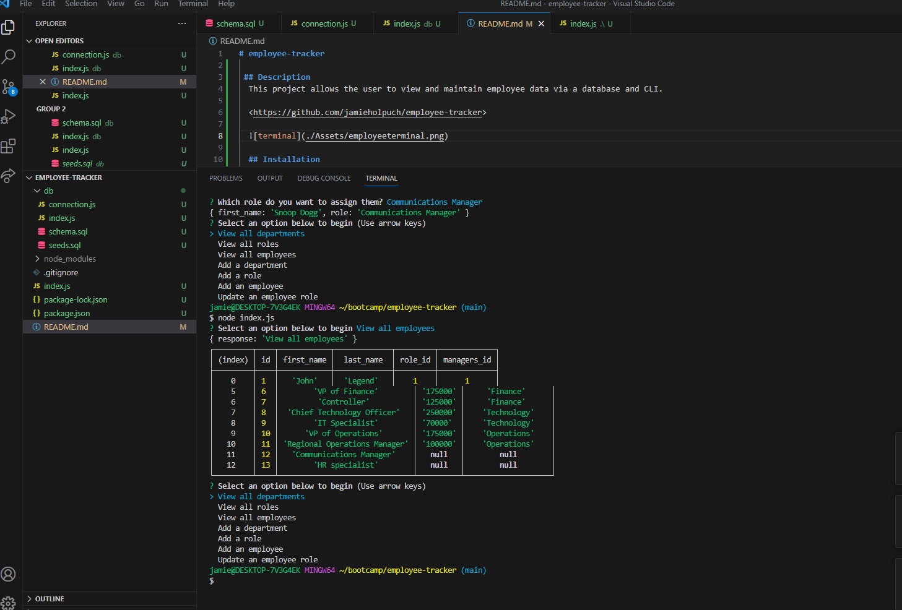

# employee-tracker

 ## Description
  This project allows the user to view and maintain employee data via a database and CLI.  

  <https://github.com/jamieholpuch/employee-tracker>

  
  
  ## Installation 
  To install, type "npm i" and install the packages into your terminal. 
  
  ## Usage
  Run sql prompts to create and seed your database. Once seeded, exit sql and use 'node index.js' initiate the prompts. 

  Demo Video: <https://drive.google.com/file/d/1JiBtRrHDI-UlKYq1wcS0ifash8WBDcpb/view>

  ## Collaborators
  Collaboration and support from tutor Benicio Lopez and instructor Eric Sayez.
  
  ## Contributing
  To contribute to this project, contact me via email. 
  
  ## Questions 
  If you have questions, please contact:
  
  GitHub: <https:////github.com/jamieholpuch>
  
  Email: jamieholpuch@gmail.com